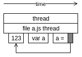

# КодисНадос

#### Асинхронности, потоки и EventEmitter.

---

@snap[midpoint text-left span-90 text-06]

###### Поток (п) - синхронный поток выполнения СК.

> Thread

> Далее рассматривается не реализация threads в конкретном компиляторе, а схематичный вариант переложенный на понятные концепции

- Состоит из потоков функций.
- Начинается в момент запроса/ответа от внешней среды или срабатывания таймера.
- Заканчивается когда все вложенные потоки функций заканчивают работу.
- Не прерывается пока, не закончит работу.



---

###### Поток функции (ПФ) - часть потока, синхронный поток выполнения СК в теле одной функции.

> Function thread

---

@snap[midpoint text-left span-90 text-06]

##### Когда thread?

```js
var a = 123;
```

---

```js
require('./a.js');
```

```js
var a = function(callback) {
  setTimeout(function() {
    callback();
  }, 1000);
};

var b = function() {};

a(b);
a(function() {});

// (function(window, global, require, console) {

// thread - это предмет, включает в себя все то что позволяет последовательно и синхронно выполниться телу одной функции, и сам процесс синхронного выполнения функции

// из чего состоит thread?

// скрытый внутри thread контекст видимости функции - { x: 123 } - наследник от такого-же объекта родительского thread
// объект с ключами = переменными объявленными непосредственно внутри тела функции в процессе выполнения thread(а) функции
// к нему нельзя получить доступ, но он существует в памяти внутри thread функции

//

// thread file

var y = 234;
// в thread файла есть объект контекста переменных этой функции
// и в нем есть ключ y и значение 234

function a() {
  var x = 123;
  // в thread этого выполнения этой функции есть объект контекста переменных этой функции
  // и в нем есть ключ x и значение 123
  // этот объект - наследний от такого же объекта у родительского thread
  // благодаря этому при обращении отсюда к y, он найдет его в роидетельском контексте переменных

  // can be the threadA of function
}

a(); // start threadA1 local context { x: 123 }
a(); // start threadA2 local context { x: 123 }

// })(window, global, require, console);
```
